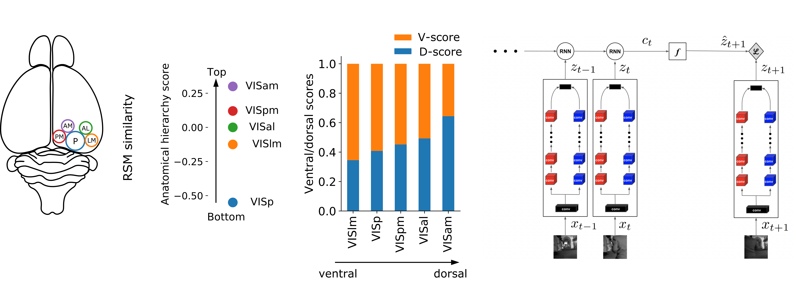

## The functional specialization of visual cortex emerges from training parallel pathways with self-supervised predictive learning

This repository contains all the codes and pretrianed models used for the experiments reported in the NeurIPS 2021 spotlight paper: "The functional specialization of visual cortex emerges from training parallel pathways with self-supervised predictive learning" 

Linkes: [[Preprint](https://www.biorxiv.org/content/10.1101/2021.06.18.448989v2)]  [[Project Page](https://ventral-dorsal-model.netlify.app/)]

## Requirements

+ Allen SDK (https://allensdk.readthedocs.io/en/latest/)
+ scipy
+ numpy
+ matplotlib
+ OpenCV
+ pytorch
+ torchvision

## Analysis 

Use the Analysis jupyter notebook in the RSM folder to run the analysis and reproduce the figures. The generated figures will be stored in the Figures folder. 

The checkpoint files of the pretrained ANNs can be found in the Checkpoints folder. 

